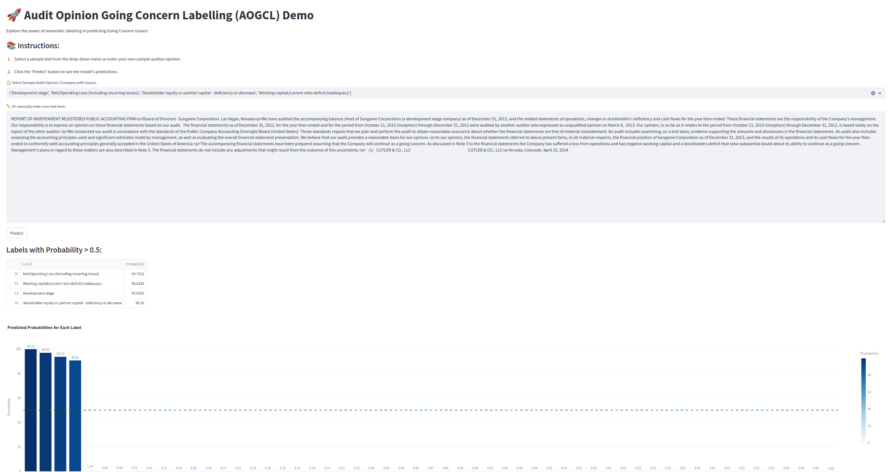

# Audit Opinion Going Concern Labelling (AOGCL)

Automatic Audit Opinion Labelling for Going Concern Issues

This is the accompanying code to our work: *"Identifying going concern issues in auditor opinions: link to bankruptcy events"*, done in the context of the *5th Financial Narrative Processing Workshop* (FNP2023@IEEE-BigData2023).

In this work, our goal is to predict possible Going Concern issues given Auditors Opinion as found in the 10K report of the company in free-text form. The Going Concern issues that are used as candidate labels are the ones used by the [AuditAnalytics](https://www.auditanalytics.com/products/sec/audit-opinions) platform. More details on the going concern used can be found in the [AuditAnalytics 20-year review](https://www.auditanalytics.com/doc/AA_Going_Concerns_A_Twenty_Year_Review.pdf) (p.16 has also a list with some of the used going concern labels).


## Demo
You can access a demo app that runs inference on given audit opinion text in this [link](http://143.233.226.57:9001/).


In the folder streamlit_app you can find the sample code to deploy locally the demo app shown above.


## Installation
The requirements for this project can be installed by running:

conda env create -f environment.yml

Python version used: Python 3.9.16


## Details
The contents of the repo are the following:

- *frozen_splits*: Folder with the train/val/test opinions data.
- *logs*: Folder to save log files.
- *results*: Folder to save resuts.
- *settings*: Folder with settings configurations.
- *enviroment.yml*: Conda enviroment to create.
- *fine_tune_lm.py*: Script used for fine-tuning the LM. The script cannot be run as is, because the labels are missing from the data here. The whole process is the same though.
- *fine_tune_rf.py*: Script used for hyper-parameter tuning on the *tf-idf + RF* model. The script cannot be run as is, because the labels are missing from the data here. The whole process is the same though.
- *early_stopper.py*: Module for the early stopping functionality.
- *focal_loss.py*: Module implementing the weighted focal loss as used in the results Section 4.3.
- *load_data.py*: Module implementing the loading/splitting and preprocessing of the data.
- *model.py*: Module containing the Langugage Model + Classifier layer, along with routines for training and evaluation.
- *utils.py*: Helper functions.

## Run
One would run either:

```cmd
python fine_tune_lm.py ./settings/wanted_settings_file.json
```

to train and evaluate a LM with the parameters as defined in the setting file or

```cmd
python fine_tune_rf.py 
```

to do a hyper-parameter tuning on the *tf-idf + RF* pipeline used as a baseline.


## Data
Currently, the above would result in an error, as **the data shared here are not annotated with the AuditAnalytic labels used in our analysis due to property rights**. For a subset of the labeled dataset please contact the authors after publication. Nonetheless, the **unlabeled frozen splits containing the auditor reports**, with other metadata as well, **are currently available and provided in the data folder** (need to be unzipped).


## Fine-tuned model
You can use the best-performing model (distilbert weighted variants as proposed in the paper) from [here](https://owncloud.skel.iit.demokritos.gr/index.php/s/E9ASzpv8o8Bltz6).


## Citation
To cite please use our publication:

*Konstantinos Bougiatiotis, Elias Zavitsanos, Georgios Paliouras. "Identifying going concern issues in auditor opinions: link to bankruptcy events". In proceedings of the 5th Financial Narrative Processing Workshop (FNP 2023) at the 2023 IEEE International Conference on Big Data (IEEE BigData 2023), Sorrento, Italy.*


